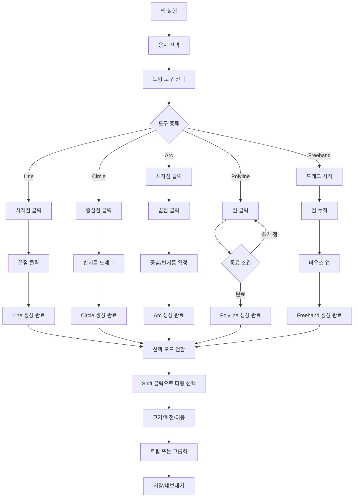

# CAD 스타일 웹 에디터 설계 문서

## 1. 목표

이 문서는 웹 기반 2D CAD 편집기 설계를 구현 가능한 수준으로 정리한 문서다. 핵심 목표는 다음과 같다.

- 웹 브라우저에서 작업 가능
- 상단 메뉴/도구바/속성 패널 구조를 유지
- 용지 기반 작업 환경 제공
- CAD 스타일의 입력 절차를 유지 (직선, 원, 호, 폴리라인, 자유형)
- Shift 다중 선택, 크기 조절, 회전, 트림, 텍스트 배치 기능 지원
- .tis 포맷으로 저장/불러오기, .png로 내보내기 지원

---

## 2. 설계 원칙

### 2.1 World space vs Viewport space 분리

모든 객체의 실제 좌표는 world space로 저장하고, 화면 표시만 viewport transform으로 렌더링한다.

- worldX, worldY: 실제 용지 좌표
- viewZoom: 확대/축소 비율
- panX, panY: 화면 이동 값
- screenX = worldX * zoom + panX

이 방식은 무한 확대/축소와 작업물 찾기 기능을 자연스럽게 구현한다.

### 2.2 선택 모드와 그리기 모드 분리

모드 분리를 반드시 유지해야 한다.

- Selection Mode
  - 객체 선택
  - Shift 다중 선택
  - 복수 객체 이동/회전/크기 조절
- Drawing Mode
  - Line
  - Circle
  - Arc
  - Polyline
  - Polygon
  - Freehand
  - Text

선택 모드와 그리기 모드는 동시에 활성화되지 않도록 한다.

### 2.3 도형 객체와 텍스트 객체는 별도 모델로 관리

도형과 텍스트는 완전히 분리된 객체로 저장한다.

- Shape 객체: 선, 면, 개방형/닫힌형 경계
- TextBox 객체: 텍스트 렌더링용 박스
- TextFlow 객체: 폴리곤 내부 자동 줄바꿈 배치용 보조 정보

이렇게 나누어야 폴리곤 내부 텍스트 기능과 일반 텍스트 기능이 충돌하지 않는다.

---

## 3. 전체 UI 구조

### 3.1 화면 구성

```mermaid
flowchart TB
    A[Top Menu Frame]
    A --> A1[File: Open / Save / Export / Recent]
    A --> A2[Page: Size / Orientation / Paper Setup]
    A --> A3[Tools: Draw / Select / Trim / Group]
    A --> A4[Style: Stroke / Fill / Font / Text color]
    A --> A5[View: Zoom / Pan / Find Work]

    B[Main Work Area]
    B --> B1[Paper Viewport]
    B --> B2[Canvas Rendering]
    B --> B3[Grid / Snap / Guide]

    C[Property Panel]
    C --> C1[Selected Object Properties]
    C --> C2[Stroke/Fill/Font Settings]
    C --> C3[Size / Rotation / Position]
    C --> C4[Trim State / Layer Info]
```



### 3.2 상단 메뉴 프레임 세부 구성

- 파일
  - 불러오기 (.tis, .txt)
  - 저장 (.tis)
  - 내보내기 (.png)
  - 최근 문서
- 편집
  - 실행 취소 / 다시 실행
  - 선택 해제
  - 그룹화 / 그룹 해제
- 보기
  - 작업물 찾기
  - 전체 화면 맞춤
  - 확대/축소
  - 그리드 표시
- 환경설정
  - 단축키 설정
  - 기본 색상
  - 기본 선 두께
  - 기본 단위(mm, px, in)

### 3.3 속성 패널 구성

- 선택된 객체 정보
- 위치: x, y
- 크기: width, height
- 회전: rotation
- 선 색, 채우기 색
- 글꼴, 글자 크기, 정렬
- 트림/층 정보

---

## 4. 실제 데이터 구조 설계

### 4.1 루트 문서 모델

```ts
interface DocumentModel {
  version: number;
  documentId: string;
  createdAt: string;
  updatedAt: string;
  paper: PaperModel;
  view: ViewState;
  styles: StylePreset;
  shapes: ShapeObject[];
  texts: TextBoxObject[];
  layers: Layer[];
  selections: SelectionGroup;
  metadata: DocumentMetadata;
}
```

### 4.2 용지 모델

```ts
interface PaperModel {
  id: string;
  name: 'A4' | 'A5' | 'A6' | 'BusinessCard' | 'Custom';
  widthMm: number;
  heightMm: number;
  widthPx: number;
  heightPx: number;
  orientation: 'portrait' | 'landscape';
  marginMm: number;
  bleedMm: number;
  unit: 'mm' | 'px';
}
```

### 4.3 뷰 상태

```ts
interface ViewState {
  zoom: number;
  panX: number;
  panY: number;
  fitMode: 'page' | 'selection' | 'custom';
  gridVisible: boolean;
  snapEnabled: boolean;
}
```

### 4.4 도형 객체

```ts
interface ShapeObject {
  id: string;
  type: 'line' | 'circle' | 'arc' | 'polyline' | 'polygon' | 'freehand';
  layerId: string;
  visible: boolean;
  locked: boolean;
  closed: boolean;
  fill: string | null;
  stroke: string;
  strokeWidth: number;
  opacity: number;
  rotation: number;
  transform: {
    x: number;
    y: number;
    width: number;
    height: number;
    centerX: number;
    centerY: number;
  };
  geometry: GeometryData;
  trimState?: TrimState;
  metadata?: Record<string, unknown>;
}
```

### 4.5 지오메트리 데이터

```ts
type GeometryData =
  | { kind: 'line'; x1: number; y1: number; x2: number; y2: number }
  | { kind: 'circle'; cx: number; cy: number; r: number }
  | { kind: 'arc'; cx: number; cy: number; r: number; startAngle: number; endAngle: number }
  | { kind: 'polyline'; points: Array<{ x: number; y: number }> }
  | { kind: 'polygon'; points: Array<{ x: number; y: number }> }
  | { kind: 'freehand'; points: Array<{ x: number; y: number }> };
```

### 4.6 텍스트 객체

```ts
interface TextBoxObject {
  id: string;
  layerId: string;
  x: number;
  y: number;
  width: number;
  height: number;
  text: string;
  fontFamily: string;
  fontSize: number;
  color: string;
  align: 'left' | 'center' | 'right';
  verticalAlign: 'top' | 'middle' | 'bottom';
  lineHeight: number;
  wrapMode: 'box' | 'shape';
  shapeId?: string;
  autoWrap: boolean;
}
```

### 4.7 레이어와 선택 상태

```ts
interface Layer {
  id: string;
  name: string;
  visible: boolean;
  locked: boolean;
  order: number;
}

interface SelectionGroup {
  selectedIds: string[];
  primaryId: string | null;
  bounds: {
    minX: number;
    minY: number;
    maxX: number;
    maxY: number;
    centerX: number;
    centerY: number;
  } | null;
}
```

---

## 5. 객체 JSON 스키마 예시

다음은 실제 저장 형식의 예시다.

```json
{
  "version": 1,
  "documentId": "doc-2026-09-26-001",
  "createdAt": "2026-09-26T10:00:00Z",
  "updatedAt": "2026-09-26T10:25:00Z",
  "paper": {
    "id": "paper-a4-portrait",
    "name": "A4",
    "widthMm": 210,
    "heightMm": 297,
    "widthPx": 2100,
    "heightPx": 2970,
    "orientation": "portrait",
    "marginMm": 3,
    "bleedMm": 3,
    "unit": "mm"
  },
  "view": {
    "zoom": 1,
    "panX": 0,
    "panY": 0,
    "fitMode": "page",
    "gridVisible": true,
    "snapEnabled": true
  },
  "styles": {
    "defaultStroke": "#1f2937",
    "defaultFill": "transparent",
    "defaultStrokeWidth": 1.2,
    "defaultFontFamily": "Arial",
    "defaultFontSize": 18
  },
  "layers": [
    { "id": "layer-1", "name": "Base", "visible": true, "locked": false, "order": 1 }
  ],
  "shapes": [
    {
      "id": "shape-001",
      "type": "line",
      "layerId": "layer-1",
      "visible": true,
      "locked": false,
      "closed": false,
      "fill": null,
      "stroke": "#1f2937",
      "strokeWidth": 1.2,
      "opacity": 1,
      "rotation": 0,
      "transform": {
        "x": 0,
        "y": 0,
        "width": 100,
        "height": 0,
        "centerX": 50,
        "centerY": 0
      },
      "geometry": {
        "kind": "line",
        "x1": 20,
        "y1": 20,
        "x2": 120,
        "y2": 120
      }
    },
    {
      "id": "shape-002",
      "type": "circle",
      "layerId": "layer-1",
      "visible": true,
      "locked": false,
      "closed": true,
      "fill": "#ffffff",
      "stroke": "#111827",
      "strokeWidth": 1.2,
      "opacity": 1,
      "rotation": 0,
      "transform": {
        "x": 150,
        "y": 80,
        "width": 80,
        "height": 80,
        "centerX": 190,
        "centerY": 120
      },
      "geometry": {
        "kind": "circle",
        "cx": 190,
        "cy": 120,
        "r": 40
      }
    }
  ],
  "texts": [
    {
      "id": "text-001",
      "layerId": "layer-1",
      "x": 160,
      "y": 170,
      "width": 160,
      "height": 40,
      "text": "Hello CAD",
      "fontFamily": "Arial",
      "fontSize": 22,
      "color": "#111827",
      "align": "left",
      "verticalAlign": "top",
      "lineHeight": 1.2,
      "wrapMode": "box",
      "autoWrap": true
    }
  ],
  "selections": {
    "selectedIds": ["shape-002"],
    "primaryId": "shape-002",
    "bounds": {
      "minX": 150,
      "minY": 80,
      "maxX": 230,
      "maxY": 160,
      "centerX": 190,
      "centerY": 120
    }
  }
}
```

### 저장 포맷 정책

- JSON을 기본 포맷으로 저장
- .tis는 JSON + 메타데이터의 zip 또는 단순 JSON 저장 구조를 채택
- 텍스트는 그대로 문자열로 저장하되, 줄 수와 폰트/박스 정보를 함께 저장

---

## 6. 도형 생성 알고리즘 설계

### 6.1 공통 규칙

모든 도형 생성은 다음 순서로 동작한다.

1. 사용자 입력 좌표 획득
2. 현재 툴에 따라 점들의 의미 결정
3. 입력 점을 geometry 타입으로 변환
4. bounds 계산
5. 객체 ID 및 기본 style 부여
6. selection 상태 갱신
7. 렌더링

### 6.2 직선 생성 알고리즘

#### 입력
- 시작점: P1
- 끝점: P2

#### 로직
```text
if tool == line:
  if first click:
    activeDraft = { type: 'line', p1: clickPoint }
  else if second click:
    p2 = clickPoint
    shape = Line(p1, p2)
    push shape
    clear activeDraft
```

#### 특이점
- 마우스 이동 중에는 가상 선 표시
- 엔터 또는 두 번째 클릭 시 확정
- Shift는 수평/수직 정렬 보조

### 6.3 원 생성 알고리즘

#### 입력
- 중심점: C
- 반지름: r = distance(C, dragPoint)

#### 로직
```text
if tool == circle:
  if first click:
    center = clickPoint
    activeDraft = { type: 'circle', center }
  else:
    radius = distance(center, currentPoint)
    if Shift pressed:
      radius = clampToUniformRadius(radius)
    create circle geometry
```

#### 권장 동작
- 첫 클릭: 중심점
- 드래그: 반지름 결정
- 마우스 업: 원 확정
- Shift: 비율 고정

### 6.4 호 생성 알고리즘

#### 입력
- 시작점: A
- 끝점: B
- 중심점 또는 반지름값: C

#### 추천 방식
CAD에서는 “시작점, 끝점, 중심점” 입력이 가장 직관적이다.

```text
if tool == arc:
  first click => start point A
  second click => end point B
  third click => center C or drag to radius
  compute radius r from C to A or C to B
  determine startAngle and endAngle from C
  create arc geometry
```

#### 각도 계산
```text
startAngle = atan2(A.y - C.y, A.x - C.x)
endAngle = atan2(B.y - C.y, B.x - C.x)
```

- 호는 clockwise / counterclockwise 방향을 정리해야 한다.
- 애니메이션 대신 경계선 미리보기 오버레이를 사용한다.

### 6.5 폴리라인 생성 알고리즘

#### 입력
- 각 점 클릭
- 마지막 점은 Enter 또는 더블클릭으로 종료

#### 로직
```text
if tool == polyline:
  if no activeDraft:
    start new polyline with first point
  else:
    push new point
    if finished:
      create shape with points array
```

#### 추천 규칙
- 완성 전에 점 간 연결은 실시간 미리보기
- 사용자 입력 순서가 유지되어야 함
- 닫힌 폴리라인이면 polygon으로 변환 가능

### 6.6 다각형 생성 알고리즘

#### 입력
- 첫 점 클릭
- 각 정점 클릭
- 마지막 점이 시작점 근처면 자동 닫힘

#### 로직
```text
if tool == polygon:
  collect points
  if distance(lastPoint, firstPoint) < tolerance:
    close polygon
  create polygon shape
```

### 6.7 자유형 생성 알고리즘

#### 입력
- 마우스 드래그로 연속 포인트 기록

#### 로직
```text
if tool == freehand:
  on mousedown: start point
  on mousemove: append points
  on mouseup: finalize path
```

- 필요시 smoothing(부드럽게) 단계 추가 가능
- 점이 너무 많으면 simplify 알고리즘을 적용

---

## 7. 트림 알고리즘 설계

트림은 가장 중요하면서도 가장 복잡한 부분이다. CAD 방식에서는 선분 단위로 처리해야 한다.

### 7.1 핵심 원리

- 도형은 선분들의 집합으로 분해한다.
- 선분이 교차하면 교차점을 계산한다.
- 교차점을 기준으로 cut boundary를 만든다.
- KEEP 영역과 CUT 영역을 구분한다.
- 남은 선분 집합만 다시 조립한다.

### 7.2 선분 표현

```ts
interface Segment {
  id: string;
  shapeId: string;
  a: { x: number; y: number };
  b: { x: number; y: number };
}
```

### 7.3 실제 절차

```text
function trimShape(shape, trimLineStart, trimLineEnd): Shape[] {
  segments = decomposeShapeToSegments(shape)
  cutSegments = [segment(trimLineStart, trimLineEnd)]

  for each segment in segments:
    intersectionPoints = findIntersections(segment, cutSegments)
    if intersectionPoints.empty:
      keep segment
    else:
      split segment at intersection points
      classify each resulting subsegment as keep or remove

  newShape = reconstructFromKeptSegments(segments)
  return newShape
}
```

### 7.4 교차 판정

#### 2D 선분 교차 함수

```text
function segmentsIntersect(a1, a2, b1, b2): boolean {
  // orientation test
  // ccw check
  // bounding box check
}
```

#### 교차점 계산

```text
function intersectSegments(a1, a2, b1, b2): Point | null {
  // line-line intersection
  // solve for t and u
  // return point if within range
}
```

### 7.5 CUT / KEEP 구분

트림은 직선 절단선의 방향과 면의 내부/외부를 판단해 KEEP 영역을 결정한다.

```text
function classifySide(point, cutStart, cutEnd, polygonCenter): 'left' | 'right' {
  // use cross product and polygon centroid
}
```

- 기준 방향이 있을 경우
  - KEEP = one side
  - CUT = opposite side
- 절단선이 다각형 안쪽으로 들어가면 남는 영역만 유지

### 7.6 재구성

절단 후 남은 선분들을 연속된 경로로 묶어 새 도형으로 만듦.

```text
function reconstructFromKeptSegments(segments): Shape[] {
  // build graph from segment endpoints
  // find connected loops
  // return polygon or polyline shapes
}
```

### 7.7 CAD 유사 동작 규칙

- 선택된 선분을 기준으로 trim 수행
- 교차점마다 이어지는 선분을 하나씩 제거
- 마우스가 가리키는 선분이 실제 trim 객체가 된다
- 하이라이트는 절단 경로와 KEEP/CUT 영역을 시각적으로 드러낸다

---

## 8. 선택 및 조작 알고리즘

### 8.1 단일 선택

- 마우스 클릭 위치에서 가장 상위 객체를 찾음
- 객체 경계 또는 내부에 포함되면 selectedId = 해당 객체

### 8.2 다중 선택

- Shift 키를 누른 상태에서 객체를 클릭하면 selection set에 추가
- 선택 해제는 Shift + 클릭 또는 Clear Selection

```text
if shiftKey && click object:
  add objectId to selectionSet
else:
  set selection = [objectId]
```

### 8.3 핸들러와 그룹 동작

- 각 도형은 8개 resize handle 보유
- 무게중심에 rotation handle 보유
- 여러 객체 선택 시 그룹 bounding box 생성
- 그룹 전체에 대해 rotation / resize 수행

```text
if selection.length > 1:
  groupBounds = computeSelectionBounds(selection)
  rotation center = groupBounds.center
  resize anchors = groupBounds corners
```

---

## 9. 텍스트 자동 줄바꿈 설계

### 9.1 Box 기반 텍스트

텍스트는 텍스트 박스에서 시작한다.

```ts
interface TextBoxObject {
  x: number;
  y: number;
  width: number;
  height: number;
  text: string;
  autoWrap: true;
}
```

### 9.2 자동 줄바꿈 로직

```text
function wrapText(text, widthPx, fontSize, fontFamily): string[] {
  // 문자 단위 또는 단어 단위로 분해
  // widthPx 기준으로 줄 수를 계산
  // 남는 문자는 다음 줄로 이동
}
```

### 9.3 폴리곤 내부 텍스트

- 폴리곤을 더블클릭하면 내부 텍스트 모드 진입
- 도형 외곽선이 텍스트의 경계 역할을 함
- 글자 폭이 경계 너비를 넘으면 다음 줄로 내려감
- 넘치는 줄은 다음 폴리곤 또는 새 박스로 이어짐

이 기능은 도형을 텍스트 영역으로 활용하는 CAD 초안 기능으로 설계한다.

---

## 10. 저장/불러오기 설계

### 10.1 .tis 포맷

.tis는 다음 구조를 갖는다.

```text
project.tis
├─ manifest.json
├─ document.json
├─ assets/
│  └─ preview.png
└─ layers/
```

- manifest.json: 버전, 생성일, 파일 구조
- document.json: 실제 문서 모델
- preview.png: 미리보기 이미지

### 10.2 .txt 불러오기

- 일반 텍스트 파일을 읽어 텍스트 박스 하나로 로드
- 줄바꿈을 자동 분할
- 텍스트 객체의 기본 폰트/위치 설정

### 10.3 .png 내보내기

- 현재 viewport를 기준으로 캔버스 또는 document 전체를 렌더링
- PNG 파일 생성
- 배경 투명/흰 바탕 선택 가능

---

## 11. UI 동작 흐름도



---

## 12. 구현상 체크포인트

### 필수 구현 우선순위

1. 용지 선택 및 viewport 관리
2. 객체 데이터 모델 및 JSON 직렬화
3. Line / Circle / Arc / Polyline / Freehand 생성
4. Shift 다중 선택 및 그룹 바운딩 박스
5. Resize / Rotation 핸들러
6. Trim 경계 계산 및 선분 분해
7. TextBox와 자동 줄바꿈
8. .tis 저장/불러오기
9. PNG 내보내기
10. 작업물 찾기 및 전체 보기 기능

### 설계 리스크

- 생성 모드와 선택 모드 혼합
- 도형 경계 계산이 실제 좌표와 렌더링 좌표로 섞이는 문제
- 트림 로직에서 도형 분해와 재조립을 정확히 구현하지 못하는 문제
- 텍스트가 도형 경계와 충돌하는 문제

이 리스크는 객체 모델을 엄격히 분리하고, world-coordinate 기반으로 설계하면 크게 줄어든다.

---

## 13. 권장 구현 전략

### 13.1 첫 단계

- Paper + View + Shape + TextBox 객체 도입
- JSON 직렬화/역직렬화 검증
- 기본 canvas 렌더링

### 13.2 둘째 단계

- Line / Circle / Arc 생성
- 점 클릭 기반 polyline 생성
- 선택 상태 처리

### 13.3 셋째 단계

- 트림 구현
- 그룹화/크기 조절/회전
- TextBox 자동 줄바꿈

### 13.4 넷째 단계

- .tis 저장/불러오기
- .png 에셋 내보내기
- 전체보기 / 작업물 찾기

---

## 14. 최종 결론

이 설계는 기능을 “기능 목록”이 아닌 “CAD 입력 패턴”으로 정리한 구조다. 따라서 사용자 경험이 자연스럽고, 구현 또한 구역별로 분리되어 유지보수하기 좋다.

특히, 다음 세 가지는 반드시 유지해야 한다.

1. world space와 viewport space 분리
2. selection mode와 drawing mode 분리
3. trim을 선분 단위로 처리하는 CAD형 구조

이 설계를 기준으로 개발을 시작하면, 요구사항에 가까운 FreeCAD 스타일 2D 웹 CAD 앱을 안정적으로 구성할 수 있다.
